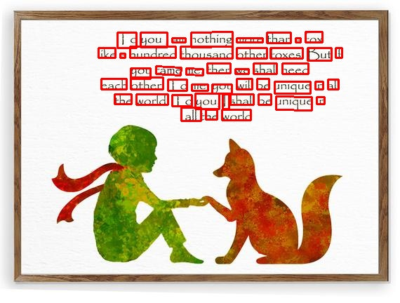

# GOOGLE OCR img2text&bbimg

이 프로젝트는 google ocr을 이용하여 이미지의 텍스트를 분석하고  
텍스트 파일과 바운딩 박스가 그려진 이미지를 출력합니다.

input image                                 |  ouput image
:------------------------------------------:|:---------------------------------------------------------:
 | 

## 실행환경
- linux(ubuntu)
- python3

## 사전준비 라이브러리 설치
    pip install --upgrade numpy
    pip install --upgrade opencv-python
    pip install --upgrade google-cloud-vision

## 사전준비 GOOGLE OCR API 인증
구글 클라우드 api 인증 가이드 페이지를 참고하여 인증을 완료합니다.
https://cloud.google.com/docs/authentication/getting-started

## 빠른 실행
분석할 이미지를 input 폴더에 넣습니다.
이후 아래 명령어를 실행합니다. 

    python google_ocr_run.py --txt --words
    
결과는 ouput 폴더에 출력됩니다.

## 옵션
프로그램 실행시, 옵션을 통해 결과를 조절할 수 있습니다.
- --txt             : 결과 텍스트 파일로 출력
- --blocks          : block 단위 박스 출력
- --paragraphs      : paragraph 단위 박스 출력
- --words           : word 단위 박스 출력
- --symbols         : symbol 단위 박스 출력
- -img_path [path]    : 입력 이미지 파일 위치  
path 입력 예시 
    - input/example.jpg  
    - input/*
- -output_path [path] : 결과 파일 출력 위치 설정

